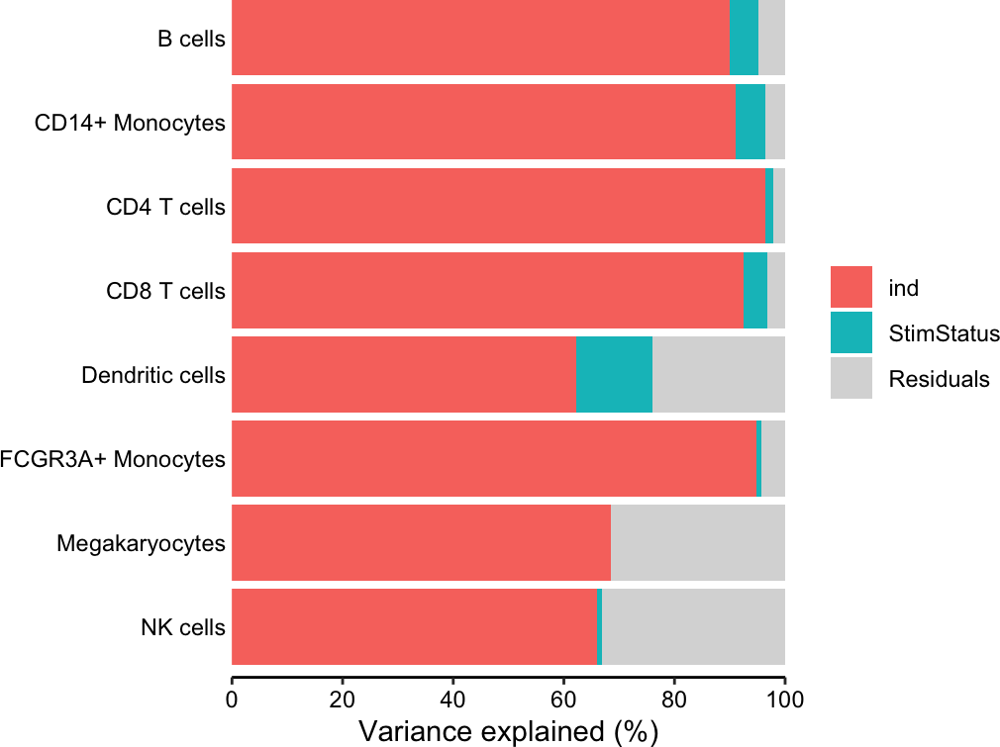
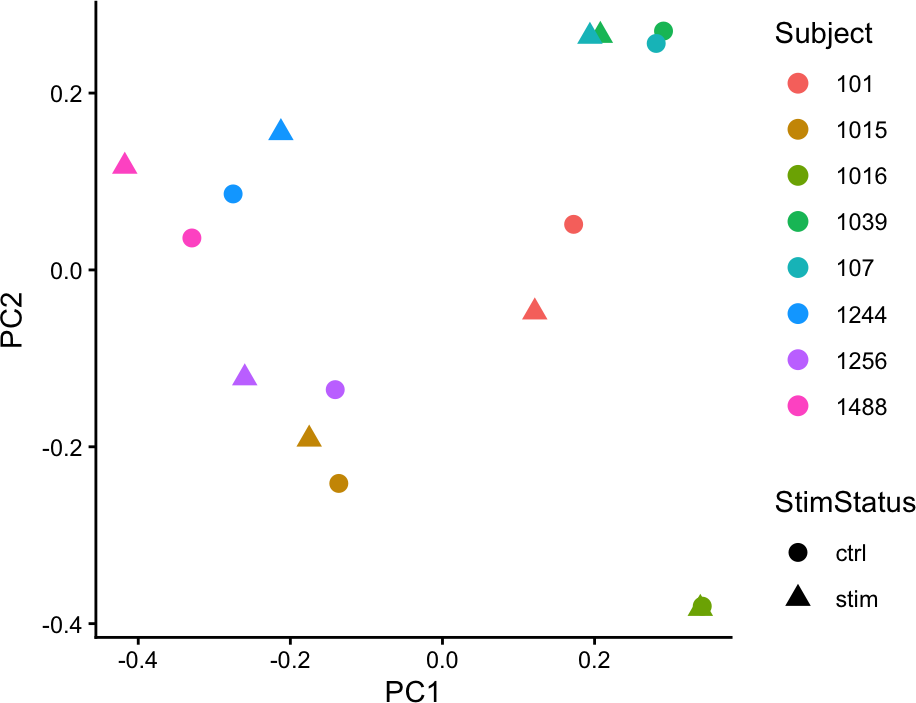
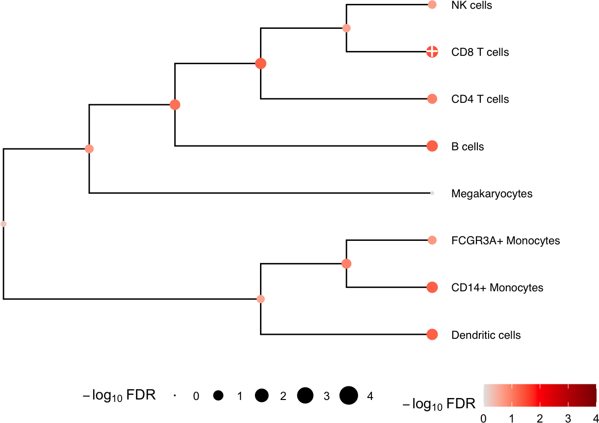
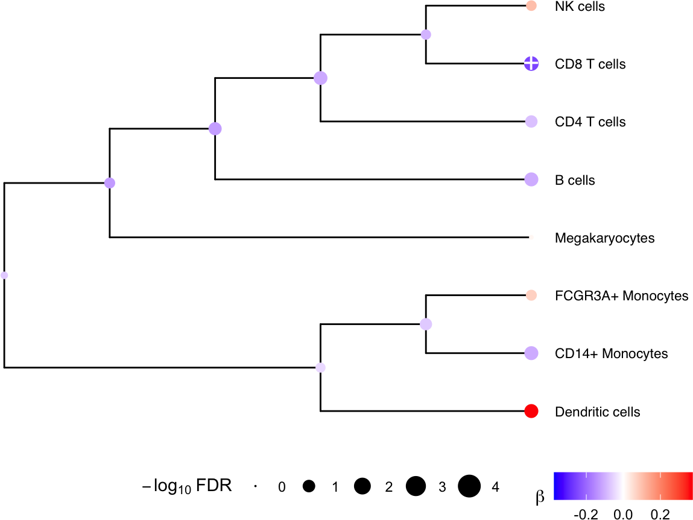
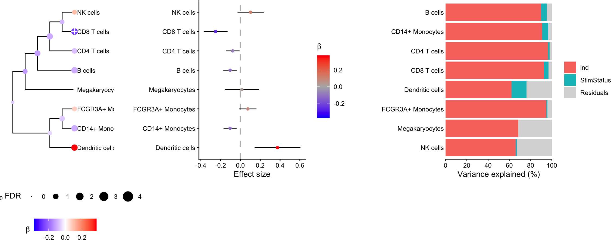

# Using crumblr in practice

### Introduction

Changes in cell type composition play an important role in health and
disease. Recent advances in single cell technology have enabled
measurement of cell type composition at increasing cell lineage
resolution across large cohorts of individuals. Yet this raises new
challenges for statistical analysis of these compositional data to
identify changes associated with a phenotype. We introduce `crumblr`, a
scalable statistical method for analyzing count ratio data using
precision-weighted linear models incorporating random effects for
complex study designs. Uniquely, `crumblr` performs tests of association
at multiple levels of the cell lineage hierarchy using multivariate
regression to increase power over tests of a single cell component. In
simulations, `crumblr` increases power compared to existing methods,
while controlling the false positive rate.

The `crumblr` package integrates with the
[`variancePartition`](https://www.bioconductor.org/packages/variancePartition/)
and [`dreamlet`](https://www.bioconductor.org/packages/dreamlet/)
packages in the Bioconductor ecosystem.

Here we consider counts for 8 cell types from quantified using single
cell RNA-seq data from unstimulated and interferon β stimulated PBMCs
from 8 subjects [(Kang, et al.,
2018)](https://www.nature.com/articles/nbt.4042).

The functions here incorporate the precision weights:

- [`variancePartition::fitExtractVarPartModel()`](http://DiseaseNeurogenomics.github.io/variancePartition/reference/fitExtractVarPartModel-method.md)
- [`variancePartition::dream()`](http://DiseaseNeurogenomics.github.io/variancePartition/reference/dream-method.md)
- [`limma::lmFit()`](https://rdrr.io/pkg/limma/man/lmFit.html)

## Installation

To install this package, start R and enter:

``` r

# 1) Make sure Bioconductor is installed
if (!require("BiocManager", quietly = TRUE)) {
  install.packages("BiocManager")
}

# 2) Install crumblr and dependencies:
# From Bioconductor
BiocManager::install("crumblr")
```

### Process data

Here we evaluate whether the observed cell proportions change in
response to interferon β. Given the results here, we cannot reject the
null hypothesis that interferon β does not affect the cell type
proportions.

``` r

library(crumblr)

# Load cell counts, clustering and metadata
# from Kang, et al. (2018) https://doi.org/10.1038/nbt.4042
data(IFNCellCounts)

# Apply crumblr transformation
# cobj is an EList object compatable with limma workflow
# cobj$E stores transformed values
# cobj$weights stores precision weights
#    corresponding to the regularized inverse variance
cobj <- crumblr(df_cellCounts)
```

### Variance partitioning

Decomposing the variance illustrates that more variation is explained by
subject than stimulation status.

``` r

library(variancePartition)

# Partition variance into components for Subject (i.e. ind)
#   and stimulation status, and residual variation
form <- ~ (1 | ind) + (1 | StimStatus)
vp <- fitExtractVarPartModel(cobj, form, info)

# Plot variance fractions
fig.vp <- plotPercentBars(vp)
fig.vp
```



### PCA

Performing PCA on the transformed cell counts indicates that the samples
cluster based on subject rather than stimulation status.

``` r

library(ggplot2)

# Perform PCA
# use crumblr::standardize() to get values with
# approximately equal sampling variance,
# which is a key property for downstream PCA and clustering analysis.
pca <- prcomp(t(standardize(cobj)))

# merge with metadata
df_pca <- merge(pca$x, info, by = "row.names")

# Plot PCA
#   color by Subject
#   shape by Stimulated vs unstimulated
ggplot(df_pca, aes(PC1, PC2, color = as.character(ind), shape = StimStatus)) +
  geom_point(size = 3) +
  theme_classic() +
  theme(aspect.ratio = 1) +
  scale_color_discrete(name = "Subject") +
  xlab("PC1") +
  ylab("PC2")
```



### Hierarchical clustering

The samples from the same subject also cluster together.

``` r

heatmap(cobj$E)
```


### Differential testing

``` r

# Use variancePartition workflow to analyze each cell type
# Perform regression on each cell type separately
#  then use eBayes to shrink residual variance
# Also compatible with limma::lmFit()
fit <- dream(cobj, ~ StimStatus + ind, info)
fit <- eBayes(fit)

# Extract results for each cell type
topTable(fit, coef = "StimStatusstim", number = Inf)
```

    ##                         logFC    AveExpr          t     P.Value  adj.P.Val         B
    ## CD8 T cells       -0.25085170  0.0857175 -4.0787416 0.002436375 0.01949100 -1.279815
    ## Dendritic cells    0.37386979 -2.1849234  3.1619195 0.010692544 0.02738587 -2.638507
    ## CD14+ Monocytes   -0.10525402  1.2698117 -3.1226341 0.011413912 0.02738587 -2.709377
    ## B cells           -0.10478652  0.5516882 -3.0134349 0.013692935 0.02738587 -2.940542
    ## CD4 T cells       -0.07840101  2.0201947 -2.2318104 0.050869691 0.08139151 -4.128069
    ## FCGR3A+ Monocytes  0.07425165 -0.2567492  1.6647681 0.128337022 0.17111603 -4.935304
    ## NK cells           0.10270672  0.3797777  1.5181860 0.161321761 0.18436773 -5.247806
    ## Megakaryocytes     0.01377768 -1.8655172  0.1555131 0.879651456 0.87965146 -6.198336

#### Multivariate testing along a tree

We can gain power by jointly testing multiple cell types using a
multivariate statistical model, instead of testing one cell type at a
time. Here we construct a hierarchical clustering between cell types
based on gene expression from pseudobulk, and perform a multivariate
test for each internal node of the tree based on its leaf nodes. The
results for the leaves are the same as from `topTable()` above. At each
internal node
[`treeTest()`](http://DiseaseNeurogenomics.github.io/crumblr/reference/treeTest.md)
performs a fixed effects meta-analysis of the coefficients of the leaves
while modeling the covariance between coefficient estimates. In the
backend, this is implemented using
[`variancePartition::mvTest()`](http://DiseaseNeurogenomics.github.io/variancePartition/reference/mvTest-method.md)
and [remaCor](https://cran.r-project.org/package=remaCor) package.

``` r

# Perform multivariate test across the hierarchy
res <- treeTest(fit, cobj, hcl, coef = "StimStatusstim")

# Plot hierarchy and testing results
plotTreeTest(res)
```



``` r

# Plot hierarchy and regression coefficients
plotTreeTestBeta(res)
```



##### Combined plotting

``` r

plotTreeTestBeta(res) +
  theme(legend.position = "bottom", legend.box = "vertical") |
  plotForest(res, hide = FALSE) |
  fig.vp
```



## Session Info

    ## R version 4.5.1 (2025-06-13)
    ## Platform: aarch64-apple-darwin23.6.0
    ## Running under: macOS Sonoma 14.7.1
    ## 
    ## Matrix products: default
    ## BLAS/LAPACK: /opt/homebrew/Cellar/openblas/0.3.33/lib/libopenblasp-r0.3.33.dylib;  LAPACK version 3.12.0
    ## 
    ## locale:
    ## [1] en_US.UTF-8/en_US.UTF-8/en_US.UTF-8/C/en_US.UTF-8/en_US.UTF-8
    ## 
    ## time zone: America/New_York
    ## tzcode source: internal
    ## 
    ## attached base packages:
    ## [1] stats     graphics  grDevices utils     datasets  methods   base     
    ## 
    ## other attached packages:
    ##  [1] lubridate_1.9.5          forcats_1.0.1            stringr_1.6.0           
    ##  [4] dplyr_1.2.1              purrr_1.2.2              readr_2.2.0             
    ##  [7] tidyr_1.3.2              tibble_3.3.1             tidyverse_2.0.0         
    ## [10] glue_1.8.1               variancePartition_1.40.2 BiocParallel_1.44.0     
    ## [13] limma_3.66.0             crumblr_1.4.4            ggplot2_4.0.3           
    ## [16] BiocStyle_2.38.0        
    ## 
    ## loaded via a namespace (and not attached):
    ##   [1] RColorBrewer_1.1-3          jsonlite_2.0.0              magrittr_2.0.5             
    ##   [4] farver_2.1.2                nloptr_2.2.1                rmarkdown_2.31             
    ##   [7] fs_2.1.0                    ragg_1.5.2                  vctrs_0.7.3                
    ##  [10] minqa_1.2.8                 ggtree_4.0.5                htmltools_0.5.9            
    ##  [13] S4Arrays_1.10.1             broom_1.0.13                SparseArray_1.10.10        
    ##  [16] gridGraphics_0.5-1          sass_0.4.10                 KernSmooth_2.23-26         
    ##  [19] bslib_0.11.0                htmlwidgets_1.6.4           desc_1.4.3                 
    ##  [22] pbkrtest_0.5.5              plyr_1.8.9                  cachem_1.1.0               
    ##  [25] lifecycle_1.0.5             iterators_1.0.14            pkgconfig_2.0.3            
    ##  [28] Matrix_1.7-5                R6_2.6.1                    fastmap_1.2.0              
    ##  [31] rbibutils_2.4.1             MatrixGenerics_1.22.0       digest_0.6.39              
    ##  [34] numDeriv_2016.8-1.1         aplot_0.3.1                 patchwork_1.3.2            
    ##  [37] S4Vectors_0.48.1            textshaping_1.0.5           GenomicRanges_1.62.1       
    ##  [40] labeling_0.4.3              timechange_0.4.0            abind_1.4-8                
    ##  [43] compiler_4.5.1              fontquiver_0.2.1            aod_1.3.3                  
    ##  [46] withr_3.0.3                 S7_0.2.2                    backports_1.5.1            
    ##  [49] viridis_0.6.5               gplots_3.3.0                MASS_7.3-66                
    ##  [52] rappdirs_0.3.4              DelayedArray_0.36.1         corpcor_1.6.10             
    ##  [55] gtools_3.9.5                caTools_1.18.3              tools_4.5.1                
    ##  [58] otel_0.2.0                  ape_5.8-1                   remaCor_0.0.20             
    ##  [61] nlme_3.1-170                grid_4.5.1                  reshape2_1.4.5             
    ##  [64] generics_0.1.4              gtable_0.3.6                tzdb_0.5.0                 
    ##  [67] hms_1.1.4                   XVector_0.50.0              BiocGenerics_0.56.0        
    ##  [70] pillar_1.11.1               yulab.utils_0.2.4           splines_4.5.1              
    ##  [73] treeio_1.34.0               lattice_0.22-9              dirmult_0.1.3-5            
    ##  [76] tidyselect_1.2.1            fontLiberation_0.1.0        SingleCellExperiment_1.32.0
    ##  [79] knitr_1.51                  fontBitstreamVera_0.1.1     reformulas_0.4.4           
    ##  [82] gridExtra_2.3.1             bookdown_0.47               IRanges_2.44.0             
    ##  [85] Seqinfo_1.0.0               SummarizedExperiment_1.40.0 RhpcBLASctl_0.23-42        
    ##  [88] stats4_4.5.1                xfun_0.60                   Biobase_2.70.0             
    ##  [91] statmod_1.5.2               matrixStats_1.5.0           stringi_1.8.7              
    ##  [94] lazyeval_0.2.3              ggfun_0.2.1                 yaml_2.3.12                
    ##  [97] boot_1.3-32                 evaluate_1.0.5              codetools_0.2-20           
    ## [100] gdtools_0.5.1               BiocManager_1.30.27         ggplotify_0.1.3            
    ## [103] cli_3.6.6                   RcppParallel_5.1.11-2       systemfonts_1.3.2          
    ## [106] Rdpack_2.6.6                jquerylib_0.1.4             dichromat_2.0-0.1          
    ## [109] Rcpp_1.1.2                  zigg_0.0.2                  EnvStats_3.1.0             
    ## [112] parallel_4.5.1              Rfast_2.1.5.2               pkgdown_2.2.1              
    ## [115] bitops_1.0-9                lme4_2.0-1                  viridisLite_0.4.3          
    ## [118] mvtnorm_1.4-2               tidytree_0.4.8              ggiraph_0.9.6              
    ## [121] lmerTest_3.2-1              scales_1.4.0                fANCOVA_0.6-1              
    ## [124] rlang_1.3.0
